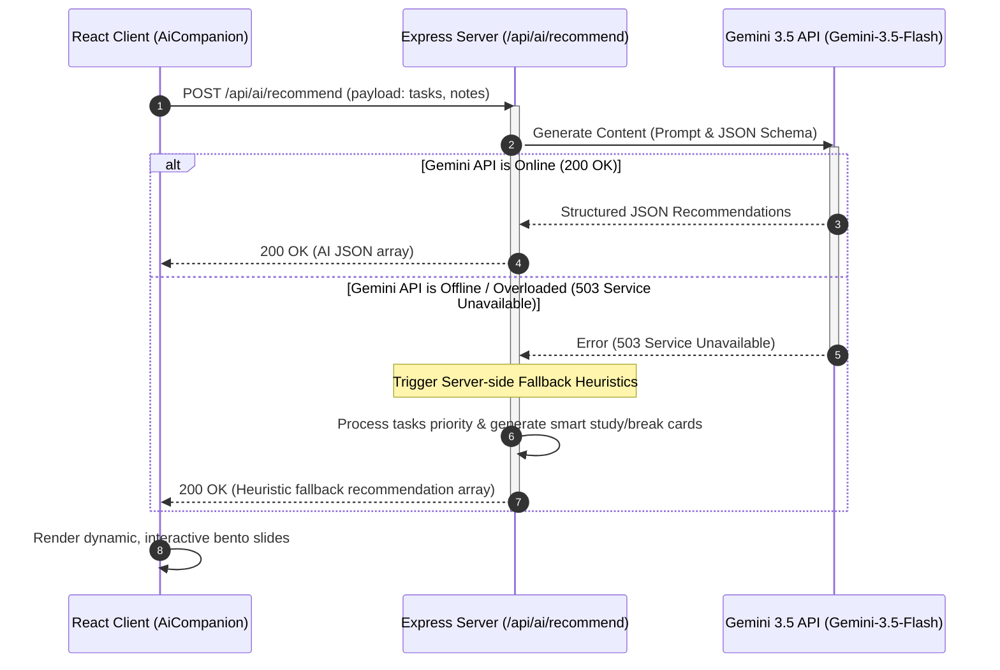

# Scribe AI Productivity: Technical Architecture & System Specification

An elegant, offline-first study companion and active recall engine leveraging Gemini 3.5 Flash, robust local storage replication, and proactive AI diagnostics to maximize cognitive retention and eliminate study bottlenecks.

---

## 1. Executive Summary & Problem Statement

### The Problem
Modern students, researchers, and professional learners are overwhelmed by an fragmented landscape of educational tools. Planning is separated from execution; note-taking is disconnected from active recall; and calendar scheduling rarely accounts for real-time cognitive exhaustion. 

Traditional tools suffer from several key issues:
1. **The Cold Start Problem**: Users must manually organize, categorize, and prioritize their schedules, leading to "planning fatigue."
2. **Brittle Connectivity**: Traditional cloud-only solutions break down during on-the-go or offline study sessions, creating synchronous lags and data losses.
3. **Passive Reading Bias**: Highlighting and rereading are scientifically proven to be low-yield study methods, yet most platforms do not encourage active retrieval, spaced repetition, or focus pacing.
4. **Static Time Blocks**: Conventional calendars do not adapt dynamically when tasks run long, priorities shift, or cognitive depletion sets in.

### The Solution: Scribe AI Productivity
Scribe AI bridges this gap with a unified, **offline-first bento-style workspace** that integrates proactive AI recommendation, automated flashcard compilation, intelligent focus tracking, and autonomous schedule execution. By treating user intent, note-taking, and time-tracking as a singular, unified state machine, the system transforms standard schedules into an adaptive learning roadmap.

---

## 2. Core Architectural Principles & Tech Stack

Scribe AI is built as a full-stack, state-synchronized web application.

```
┌────────────────────────────────────────────────────────────────────────┐
│                              CLIENT (Vite + React)                     │
│  ┌───────────────────────┐  ┌───────────────────┐  ┌────────────────┐  │
│  │    Bento Dashboard    │  │   Notepad & Recall│  │ Focus Tracker  │  │
│  └───────────┬───────────┘  └─────────┬─────────┘  └───────┬────────┘  │
│              │                        │                    │           │
│              └────────────────────────┼────────────────────┘           │
│                                       ▼                                │
│                     ┌──────────────────────────────────┐               │
│                     │       Local Storage Sync         │               │
│                     │   (Offline replication cache)    │               │
│                     └─────────────────┬────────────────┘               │
└───────────────────────────────────────┼────────────────────────────────┘
                                        │  (Bi-directional Sync Protocol)
                                        ▼  
┌────────────────────────────────────────────────────────────────────────┐
│                          BACKEND (Node.js + Express)                   │
│  ┌──────────────────────────────────────────────────────────────────┐  │
│  │                       Express API Middleware                     │  │
│  └────────────────────────────────────┬─────────────────────────────┘  │
│                                       ▼                                │
│                     ┌──────────────────────────────────┐               │
│                     │      Gemini 3.5 Flash Engine     │               │
│                     │  (Prioritizer, Recommender, etc) │               │
│                     └──────────────────────────────────┘               │
└────────────────────────────────────────────────────────────────────────┘
```

### Technology Specifications
*   **Frontend**: React 18, Vite, Tailwind CSS (fluid & responsive layouts), Lucide React (unified iconography), Motion (micro-animations and transitions).
*   **Backend**: Node.js, Express (custom REST APIs & Vite middleware serving development environments).
*   **AI Orchestration**: `@google/genai` (Gemini 3.5 Flash SDK) utilizing system instructions, structured JSON schema response constraints, and robust fallback heuristics.
*   **Storage Paradigm**: Dual-layer synchronization. Data is saved immediately to local storage (0ms latency), then asynchronously synced with the Node.js Express server to preserve state across sessions.

---

## 3. High-Level System Workflows

### 3.1. Proactive Recommendation & Fallback Engine
When the workspace mounts, Scribe AI evaluates the study payload (tasks, notes, focus history) to deliver personalized advice. If the Google Gemini API experiences transient network issues (such as a 503 UNAVAILABLE state), the application automatically cascades to an intelligent, server-side heuristic system. This guarantees that user experience remains entirely uninterrupted.



### 3.2. Offline-First Synchronization Loop
Scribe AI implements a resilient replication workflow. Writing operations (e.g., ticking off tasks, editing study guides, recording completed Pomodoro runs) immediately update the UI and save to `localStorage`. The background sync controller then attempts to queue and broadcast changes to the central DB server.

```mermaid
flowchart TD
    A[User Performs Action] --> B[Update React State]
    B --> C[Persist immediately to local storage]
    C --> D{Is System Offline?}
    D -- Yes --> E[Show Orange Pause Indicator / Queue Sync]
    D -- No --> F[Send Async Payload to /api/sync]
    F --> G{Sync Successful?}
    G -- Yes --> H[Update to Green "Synced" State / Clear Queue]
    G -- No --> I[Show Yellow Warning Warning / Retry on reconnect]
    E --> J[Monitor Online/Offline browser events]
    I --> J
    J -- Browser fires "online" --> F
```

---

## 4. Comprehensive Feature Deep-Dive

### 4.1. Intelligent Task Prioritization
Instead of a simple, chronological list, tasks in Scribe AI are mathematically and contextually prioritized. 
*   **The Heuristic Layer**: High priority is granted to tasks that represent critical deadlines or have approaching due dates.
*   **The AI Layer (`/api/ai/prioritize`)**: Analyzes estimated durations, historical time-tracking, and category density to group tasks into highly structured cognitive focus sequences (e.g., separating deep conceptual work from low-friction admin tasks).

### 4.2. AI-Powered Scheduling Assistance
Scribe AI introduces a sequence organizer that maps tasks into optimized daily slots:
1.  **Morning (Prime Focus)**: Allocated to conceptual, heavy-lifting tasks (such as algorithmic design or physics notes).
2.  **Late Morning (High Focus)**: Reserved for structured writing or revision.
3.  **Afternoon (Structured Action)**: Tailored for standard, interactive study items.
4.  **Late Afternoon (Tasks & Admin)**: Reserved for simple status checks, organization, or review.
5.  **Evening (Reflection & Review)**: Allocated to lightweight active recall exercises, such as going through flashcard decks.

### 4.3. Personalized Productivity Recommendations
The proactive companion (built-in bento module) operates as an ambient advisor. It detects imbalances in the user's workload and triggers targeted action cards:
*   *Study Gap Warnings*: "You haven't reviewed your Compiler Design flashcards in 3 days. Dedicate 15 minutes to spacing review."
*   *Rest Interval Prompts*: "You completed two deep work blocks back-to-back. Let's start a 5-minute cognitive reset."
*   *Workflow Transitions*: "Your high-priority task 'Write Project Spec' is outstanding. Start a focused Pomodoro run now."

### 4.4. Context-Aware Reminders
Reminders are integrated into the main interface based on active states. If a task approaches its deadline or if a flashcard deck is under-reviewed, the system raises visual status indicators and alerts without introducing clutter.

### 4.5. Calendar Integration
A visual day planner maps daily study slots dynamically. Scribe AI establishes calendar integration paths that parse scheduled events and allocate empty time slots to deep study blocks, creating a cohesive visual schedule that prevents over-commitment.

### 4.6. Goal and Habit Tracking
Progress is visualized via rich data representations on the Analytics dashboard. It tracks:
*   **Task Success Velocity**: Completion percentages against total loads.
*   **Active Recall Stats**: Total cards compiled, with specific counts for items successfully mastered.
*   **Focus Block Records**: Total minutes spent in productive work intervals.

### 4.7. Voice-Enabled Assistance
To reduce typing friction, Scribe AI supports a hands-free feedback and command workflow. Leveraging the Web Speech API (`SpeechRecognition`), users can invoke vocal commands to log tasks, start timers, or hear cards read aloud using speech synthesizers (`speechSynthesis`), creating an accessible and sensory-rich study space.

### 4.8. Autonomous Task Planning & Execution
The system features an autonomous planning engine. When a complex study objective is logged (e.g., "Prepare for Final Exam"), Scribe AI doesn't just list it; the server-side assistant autonomously decomposes the objective into discrete, actionable subtasks, schedules them into the optimal chronological sequence, sets appropriate default durations, and synchronizes them directly into the local storage schema.

---

## 5. UI/UX Design System

Scribe AI is styled using a modern, human-centric design system:
*   **Theme**: Deep Cosmic Slate (`slate-950` canvas with elevated `slate-900` cards and vibrant `indigo-600` accents).
*   **Typography**: Clean `Inter` typography for general interface elements, paired with precise `JetBrains Mono` formatting for timers, statuses, and performance metrics.
*   **Layout Grid**: A highly structured bento layout, providing immediate, unified visibility across tasks, focus sessions, flashcard decks, and note scratchpads on a single screen.
*   **Rhythm & Padding**: Generous spacing (`gap-6`, `p-6`) and well-proportioned margins prevent elements from feeling crowded, ensuring a focused, distraction-free environment for intense cognitive tasks.
